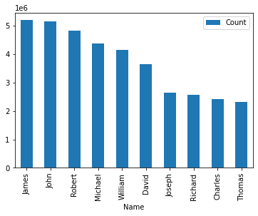
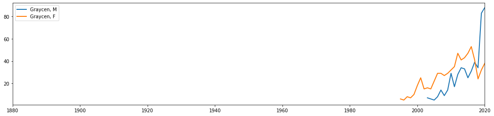
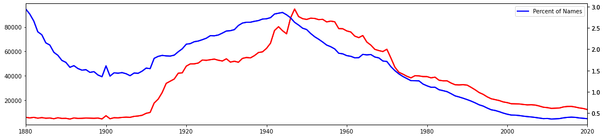
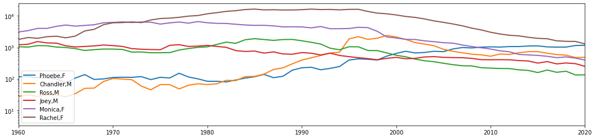

# User's guide
This project was created to evaluate the names found in the US Social Security names database from 1880 to 2020: 
1) main.ipynb: is a Jupyter document that will walk you through each step of the project with documentation, uses pip -r requirements.txt
2) make_all_yearsCSV.py: this file creates a new csv file by combining each year's txt file from the US social security database.
3. make_name_stats.py: this file creates a new csv file by evaluating all_years.csv and adding columns for the first and last year the name appeared as well as the peak year. 

# Requirements
The following modules must be installed for `main.ipynb` to run correctly.  
- Python 3.7 or higher
- pandas        # version must be at least 1.2.4
- re
- numpy         # version must be at least 1.20.1
- matplotlib    # version must be at least 3.3.4

# Installation 
__Before__ running the files, you will need to install the following modules. 

for main.ipynb
- use pip to install the required third party packages:  ` pip -r requirements.txt`

for make_all_yearsCSV.py
- use pip to install the required third party packages:  ` pip -r requirements.txt`

for make_name)statsCSV.py
- use pip to install the required third party packages:  ` pip -r requirements.txt`

# Usage
- From your IDE (integrated development environment)  you can just run the relevant .py and .ipynb files. If you don't have a IDE, open a terminal,cd to the appropriate folder and type in python <.py file>

- `main.ipynb`: run it in the project root folder, so it can import from the appropriate csv files

__Note:__ All names are from Social Security card applications for births that occurred in the United States after 1879. Note that many people born before 1937 never applied for a Social Security card, so their names are not included in our data. For others who did apply, our records may not show the place of birth, and again their names are not included in our data.

This Jupyter Notebook is intended to be used to explore the name database. It can be used to compare specific names and general trends. Here a sample of charts that were generated using the dataset.

Chart displaying the most popular male names

Chart displaying a single name

Chart showing names with the percent of total names used that year

Chart displaying a group of names

# Known issues
None

# Acknowledgments
A sincere thank you to Professor Chris Harding for the interest he took in my project, his curiosity, and the countless marathon help sessions. 